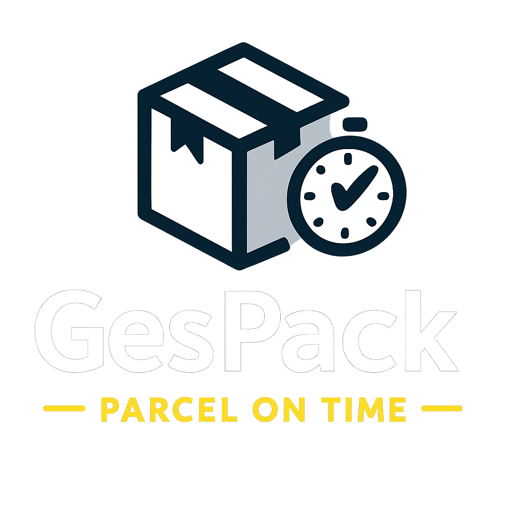
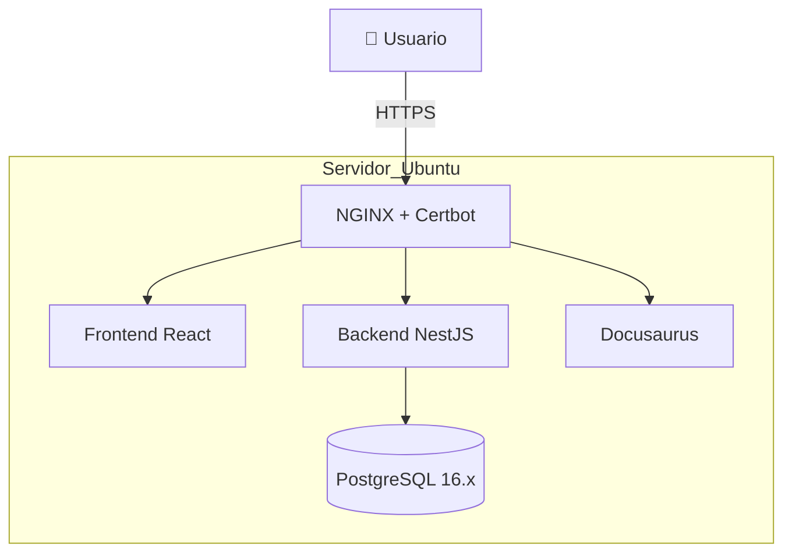

<p align="center">
  
</p>

# 📦 GesPack – Monorepo de Gestión Multiempresa

**GesPack** es una solución integral para la gestión de pedidos, clientes, inventario, facturación y comunicaciones, diseñada para entornos multiempresa (*multi-tenant*).
Incluye **frontend** (React + TypeScript), **backend** (NestJS), documentación técnica (Docusaurus), configuración de **NGINX con HTTPS**, y scripts de despliegue automatizado, todo en un único repositorio.

---

## 🗂️ Estructura del monorepo

```plaintext
GesPack/
├── backend/           # API y lógica de negocio (NestJS + TypeORM + PostgreSQL)
├── frontend/          # Aplicación web (React + TypeScript + Vite)
├── docs/              # Documentación técnica (Docusaurus)
├── nginx/             # Configuración NGINX + Certbot (HTTPS)
├── postgresql/        # Scripts de BBDD (.psql) y migraciones
├── scripts/           # Scripts de despliegue y utilidades
├── docker-compose.yml # Orquestación de servicios
└── README.md          # Este archivo
```

---

## 🚀 ¿Qué incluye GesPack?

* **Frontend** → React + Vite con hot reload, responsive y multiusuario.
* **Backend** → NestJS con autenticación JWT, gestión de datos multi-tenant y API RESTful.
* **NGINX + HTTPS** → Servidor inverso con Certbot para certificados SSL automáticos.
* **Multi-tenant** → `site_id` obligatorio en todas las tablas para aislamiento por cliente.
* **Documentación** → Docusaurus accesible vía `/docs/`.
* **Despliegue automatizado** → Scripts Bash para Mac → Ubuntu con `rsync` y Docker.
* **Base de datos** → PostgreSQL 16.x con índices, claves foráneas y auditoría en todas las tablas.

---

## 🛠️ Despliegue rápido

### 1️⃣ Clonar el repositorio

```bash
git clone git@github.com:TuUsuario/GesPack.git
cd GesPack
```

### 2️⃣ Crear la red externa

> Solo la primera vez:

```bash
docker network create --driver bridge shared-network
```

### 3️⃣ Despliegue con script global

En **Mac**:

```bash
bash scripts/deploy_all_GesPack.sh
```

Este script:

1. Detiene y elimina contenedores antiguos.
2. Limpia imágenes y redes huérfanas.
3. Sincroniza frontend, backend, docs y nginx.
4. Reconstruye y levanta todos los servicios.

---

## 🌐 Servicios en producción

| Servicio | URL                                                                | Puerto |
| -------- | ------------------------------------------------------------------ | ------ |
| Frontend | [https://gespack.parcelontime.es](https://gespack.parcelontime.es) | 443    |
| Backend  | `https://gespack.parcelontime.es/api/`                             | 443    |
| Docs     | `https://gespack.parcelontime.es/docs/`                            | 443    |

---

## 🗄️ Base de datos

* **Modelo**: PostgreSQL 16.x
* **Diseño**: multi-tenant (`site_id` en todas las tablas)
* **Scripts**: `/postgresql/*.psql` listos para `psql`
* **Migraciones**: ordenadas según dependencias
* **Auditoría estándar**:

  * `created_by`, `created_at`, `modified_by`, `updated_at`
* **Optimización**: índices combinados (`site_id` + campo de búsqueda)

---

## 📝 Documentación

Toda la documentación extendida se encuentra en Docusaurus (`/docs/`) y cubre:

* Manual de despliegue Frontend/Backend
* Configuración NGINX + Certbot
* Publicación a través de Stormshield
* Modelo de datos y ER completo
* Migración de SQL Server a PostgreSQL

---

## 💡 Buenas prácticas en GesPack

* Tablas y campos en **snake\_case** y en inglés.
* Uso de **índices compuestos** para optimizar queries multi-tenant.
* Scripts de **backup** y **restore** documentados.
* Separación clara de servicios en **Docker Compose**.
* Mantener `readme-assets/` para imágenes del README.

---

## 🔍 Diagrama de infraestructura



---

## 👥 Contribuir

1. Abre un *issue* o *pull request*.
2. Respeta la estructura del monorepo.
3. Actualiza la documentación si tu cambio afecta a despliegue o BBDD.

---

## 📧 Contacto

* **Responsable:** Iván López
* **Email:** [ilopez@parcelontime.es](mailto:ilopez@parcelontime.es)

---

## 📄 Licencia

Este proyecto y su documentación son propiedad exclusiva de Iván López  
Prohibida su copia o distribución sin autorización expresa.  
© 2025 Iván / Parcel On Time S.R.L. – Todos los derechos reservados.
