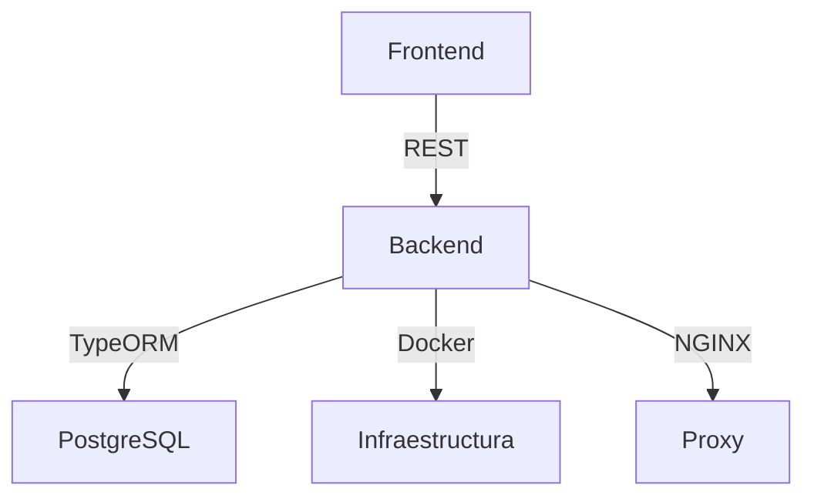

# Arquitectura del Backend

GesPack utiliza NestJS como framework principal para el backend, junto con TypeORM y PostgreSQL para la persistencia de datos.

## Diagrama de arquitectura

## Capas principales
- **Controladores**: Reciben las peticiones HTTP y delegan la lógica.
- **Servicios**: Implementan la lógica de negocio y gestionan los datos.
- **Entidades**: Representan las tablas de la base de datos.
- **DTOs**: Definen la estructura de los datos que viajan entre frontend y backend.
- **Módulos**: Agrupan funcionalidades relacionadas (pedidos, usuarios, productos, etc).

## Flujo básico
1. El frontend realiza una petición HTTP (por ejemplo, crear pedido).
2. El controlador recibe la petición y la valida.
3. El servicio procesa la lógica y accede a la base de datos mediante entidades y repositorios.
4. Se responde al frontend con un DTO.

---

Siguiente: [Estructura de carpetas](./estructura)
