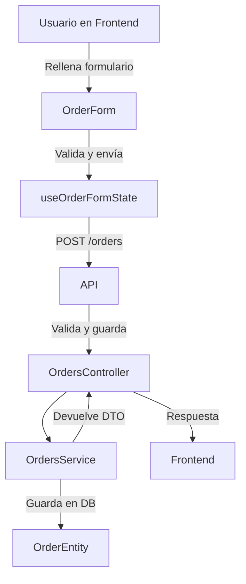

# ⚙️ Flujo técnico: creación de pedido

Esta guía explica el proceso técnico completo para crear un pedido en GesPack, con diagramas, tablas y ejemplos visuales.

## 1. Diagrama de flujo



## 2. Componentes y hooks implicados

| Componente/Hook      | Propósito                                    |
|---------------------|-----------------------------------------------|
| OrderForm           | Renderiza el formulario completo              |
| useOrderFormState   | Gestiona estado, validaciones y envío         |
| CustomerFields      | Datos del cliente                             |
| PaymentFields       | Configuración de pago y cuotas                |
| NotesFields         | Observaciones internas/externas               |

## 3. Ejemplo visual de integración

```tsx
// src/pages/CreateOrder.tsx
export function CreateOrder() {
  const {
    order,
    setOrderField,
    submitOrder,
    errors
  } = useOrderFormState();

  return (
    <OrderForm
      order={order}
      setOrderField={setOrderField}
      onSubmit={submitOrder}
      errors={errors}
    />
  );
}
```

## 4. Backend: endpoint y servicio

```typescript
// src/orders/orders.controller.ts
@Post()
async create(@Body() dto: CreateOrderDto) {
  return this.ordersService.createOrder(dto);
}

// src/orders/orders.service.ts
async createOrder(dto: CreateOrderDto): Promise<OrderResponseDto> {
  // Validación y lógica
  const order = this.ordersRepository.create(dto);
  await this.ordersRepository.save(order);
  return toOrderResponseDto(order);
}
```

## 5. Validaciones y errores

:::caution
El backend valida campos obligatorios, tipos y reglas de negocio. Si hay errores, responde con mensajes claros para el frontend.
:::

## 6. Extensión y personalización

- Para añadir campos, modifica el DTO y la entidad.
- Para cambiar la lógica, edita el servicio y el hook correspondiente.
- Añade tests y documentación para cada cambio.

---

¿Dudas? Consulta el canal de soporte o la documentación ampliada.
