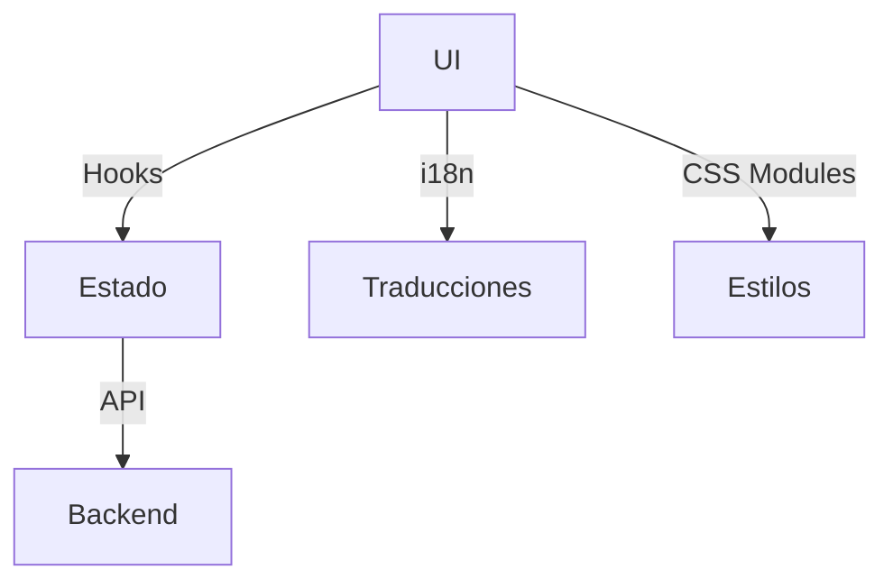

# Arquitectura del Frontend

GesPack utiliza React y Vite para construir una SPA modular y rápida.

## Diagrama de arquitectura

## Capas principales
- **Componentes**: Elementos visuales reutilizables.
- **Hooks**: Lógica de negocio y conexión con la API.
- **Páginas**: Vistas principales de la aplicación.
- **Contextos**: Estado global y gestión de usuario/sitio.
- **Utils**: Funciones auxiliares y helpers.

## Flujo básico
1. El usuario interactúa con la UI.
2. Los hooks gestionan el estado y las llamadas a la API.
3. Los datos se renderizan en los componentes y páginas.

---

Siguiente: [Estructura de carpetas](./estructura)
