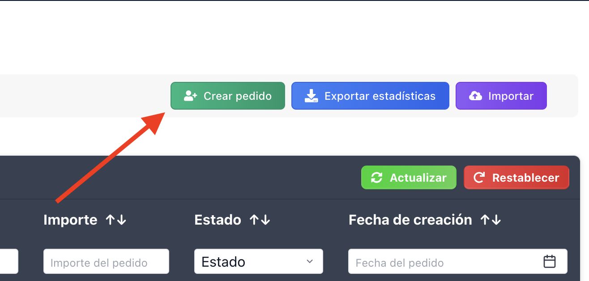
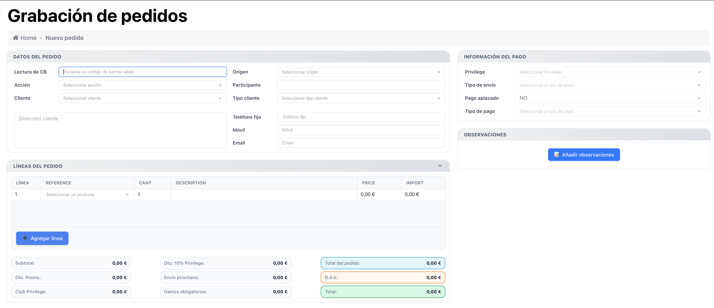
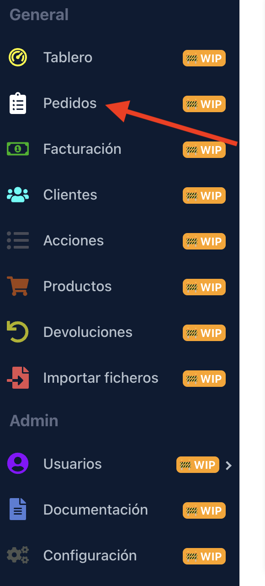

# 📝 Cómo crear un pedido en GesPack

Crear un pedido es sencillo y rápido. Sigue estos pasos visuales y prácticos:

## 1. Accede a la sección de pedidos

➡️ Ve al menú principal y haz clic en **Pedidos**.

## 2. Pulsa el botón "Crear pedido"

🟢 Haz clic en el botón **Crear pedido** para abrir el formulario.

## 3. Completa el formulario

El formulario está dividido en secciones. Aquí tienes una tabla resumen:

| Sección            | Campos principales                          | Descripción                       |
|--------------------|---------------------------------------------|-----------------------------------|
| Datos del pedido   | Referencia, Sitio, Marca                    | Identificación y contexto         |
| Cliente            | Nombre, Apellidos, Teléfono, Email, Dirección| Selección o alta de cliente       |
| Líneas de pedido   | Producto, Cantidad, Precio                  | Añade productos y cantidades      |
| Pago               | Tipo de pago, cuotas, importe               | Configura el método de pago       |
| Observaciones      | Internas, Externas                          | Notas para personal y cliente     |

:::tip
Puedes buscar clientes existentes o crear uno nuevo desde el mismo formulario.
:::

## 4. Validación y envío

🔍 Revisa que todos los campos obligatorios estén completos.

:::caution
Si hay errores, el sistema te avisará y marcará los campos a corregir.
:::

Haz clic en **Guardar** para crear el pedido.

## 5. Confirmación

✅ Verás un mensaje de éxito y el pedido aparecerá en la lista.

## 6. Ayuda y soporte

💡 Usa los tooltips (icono ℹ️) para ver información adicional sobre cada campo.

:::info
Próximamente podrás consultar el chatbot integrado para resolver dudas en tiempo real.
:::

---

¿Tienes dudas? Consulta la documentación técnica o contacta con soporte.
