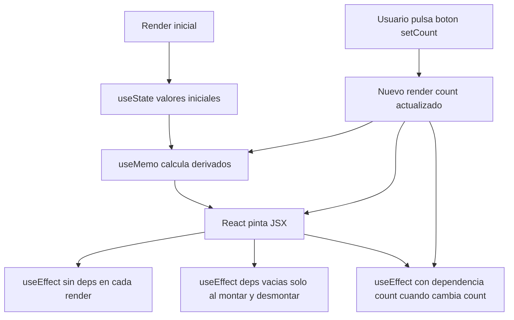

# Hooks: useState, useEffect, useMemo — Flujo

```mermaid
flowchart TD
  A["Render inicial"]
  B["useState valores iniciales"]
  C["useMemo calcula derivados"]
  D["React pinta JSX"]
  E["useEffect sin deps en cada render"]
  F["useEffect deps vacias solo al montar y desmontar"]
  G["useEffect con dependencia count cuando cambia count"]
  H["Usuario pulsa boton setCount"]
  I["Nuevo render count actualizado"]

  A --> B --> C --> D
  D --> E
  D --> F
  D --> G
  H --> I
  I --> C
  I --> D
  I --> G
```