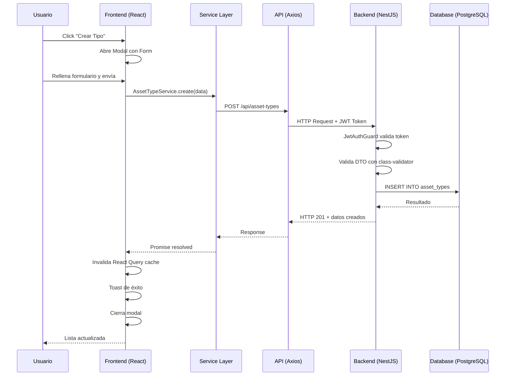

# Arquitectura del Sistema

## 📋 Descripción General

IT Inventory es un sistema multi-site de gestión de activos tecnológicos desarrollado con arquitectura monorepo que incluye:
- **Backend**: NestJS + TypeScript + TypeORM + PostgreSQL
- **Frontend**: React + TypeScript + Vite + TailwindCSS + Zustand
- **Documentación**: Docusaurus

## 🏗️ Estructura del Monorepo

```
IT-Inventory-POT/
├── backend/              # API REST con NestJS
├── frontend/             # Aplicación web React
├── documentation/        # Sitio de documentación Docusaurus
└── scripts/             # Scripts SQL y utilidades
```

## 🎯 Backend - Arquitectura Modular

### Estructura de Proyecto

```
backend/
├── src/
│   ├── entities/                    # Entidades TypeORM (modelos de BD)
│   ├── [module-name]/               # Módulos independientes
│   │   ├── [module-name].controller.ts
│   │   ├── [module-name].service.ts
│   │   ├── [module-name].module.ts
│   │   └── dto/
│   │       └── [module-name].dto.ts
│   ├── middleware/                  # Guards y middlewares
│   ├── config/                      # Configuración
│   ├── utils/                       # Utilidades
│   ├── app.module.ts               # Módulo raíz
│   └── main.ts                     # Punto de entrada
├── package.json
└── tsconfig.json
```

### Patrón de Módulos

Cada módulo es **completamente independiente** con su propia estructura:

**Regla crítica**: NUNCA mezclar múltiples recursos en un módulo. Ejemplo correcto:
- ✅ `asset-os-versions/` y `asset-os-families/` son módulos SEPARADOS
- ❌ NO anidar: `asset-os/families/` y `asset-os/versions/`

**Ejemplo de módulo**:
```typescript
// asset-types/asset-types.controller.ts
@Controller('asset-types')
@UseGuards(JwtAuthGuard)
@ApiTags('asset-types')
export class AssetTypesController {
  constructor(private readonly service: AssetTypesService) {}
  
  @Get()
  async findAll() { return this.service.getAll(); }
  
  @Post()
  async create(@Body() dto: CreateAssetTypeDto) {
    return this.service.create(dto, req.user.id);
  }
}

// asset-types/asset-types.service.ts
@Injectable()
export class AssetTypesService {
  constructor(
    @InjectRepository(AssetType)
    private repository: Repository<AssetType>
  ) {}
  
  async getAll() {
    return this.repository.find({
      relations: ['creator', 'updater'],
      order: { sortOrder: 'ASC' }
    });
  }
}

// asset-types/asset-types.module.ts
@Module({
  imports: [TypeOrmModule.forFeature([AssetType])],
  controllers: [AssetTypesController],
  providers: [AssetTypesService],
  exports: [AssetTypesService]
})
export class AssetTypesModule {}
```

### Entidades TypeORM

Todas las entidades incluyen auditoría completa:

```typescript
@Entity('asset_types')
export class AssetType {
  @PrimaryGeneratedColumn('increment', { type: 'bigint' })
  id: number;
  
  @Column({ type: 'text', unique: true })
  name: string;
  
  @Column({ name: 'is_active', default: true })
  isActive: boolean;
  
  // Auditoría
  @ManyToOne(() => User, { nullable: true })
  @JoinColumn({ name: 'created_by' })
  creator: User;
  
  @ManyToOne(() => User, { nullable: true })
  @JoinColumn({ name: 'updated_by' })
  updater: User;
  
  @CreateDateColumn({ name: 'created_at' })
  createdAt: Date;
  
  @UpdateDateColumn({ name: 'updated_at' })
  updatedAt: Date;
}
```

### DTOs y Validación

Validación automática con `class-validator`:

```typescript
export class CreateAssetTypeDto {
  @IsNotEmpty({ message: 'El nombre es requerido' })
  @IsString()
  name: string;
  
  @IsBoolean()
  @IsOptional()
  isActive?: boolean;
  
  @IsInt()
  @IsOptional()
  sortOrder?: number;
}

export class UpdateAssetTypeDto extends PartialType(CreateAssetTypeDto) {}
```

### Seguridad y Autenticación

**JWT + RBAC (Role-Based Access Control)**:

```typescript
// Guards
@UseGuards(JwtAuthGuard)  // Valida token JWT
@RequirePermission('assets:create')  // Verifica permiso específico
async create(@Body() dto: CreateAssetDto) {
  // ...
}

// Roles disponibles
- admin: Acceso total al sistema
- it: Gestión de activos y empleados
- viewer: Solo lectura

// Permisos granulares
assets:read, assets:create, assets:update, assets:delete
employees:read, employees:manage
assetCPU:read, assetRAM:read, assetStorage:read
```

### Multi-Site Architecture

El sistema soporta múltiples sitios (empresas/sedes):

```typescript
// Backend: Filtrado automático por site
@Get()
async findAll(@Req() req: AuthRequest) {
  const siteId = req.user.selectedSiteId;
  return this.service.getAll(siteId);
}

// Frontend: Store global de sitio seleccionado
const authStore = useAuthStore();
const siteId = authStore.selectedSiteId;

// Usuarios pueden tener diferentes roles por sitio
user_site_roles: { user_id, site_id, role_id }
```

## 🎨 Frontend - Service-Layer Architecture

### Estructura de Proyecto

```
frontend/
├── src/
│   ├── components/
│   │   ├── common/           # Componentes reutilizables (Modal, DataTable)
│   │   ├── forms/            # Formularios de entidades
│   │   └── Layout/           # Sidebar, Navbar, Footer
│   ├── pages/                # Páginas principales (AssetsPage, EmployeesPage)
│   ├── services/             # Capa de servicios API
│   │   ├── api.ts           # Instancia axios configurada
│   │   ├── authService.ts
│   │   ├── assetService.ts
│   │   └── ...
│   ├── store/                # Zustand stores (authStore)
│   ├── hooks/                # Hooks personalizados (useInactivityLogout)
│   ├── utils/                # Utilidades (cookies, uiHelpers)
│   ├── App.tsx
│   └── main.tsx
├── package.json
└── vite.config.ts
```

### Capa de Servicios

Los servicios exportan objetos con métodos, NO clases:

```typescript
// services/assetTypeService.ts
import api from './api';

export const AssetTypeService = {
  async getAll() {
    const response = await api.get('/asset-types');
    return response.data;
  },
  
  async create(data: CreateAssetTypeDto) {
    const response = await api.post('/asset-types', data);
    return response.data;
  },
  
  async update(id: number, data: UpdateAssetTypeDto) {
    const response = await api.put(`/asset-types/${id}`, data);
    return response.data;
  }
};

// services/api.ts - Instancia axios con interceptores
const api = axios.create({
  baseURL: 'http://localhost:3000/api',
});

api.interceptors.request.use(config => {
  const token = getAuthToken();
  if (token) config.headers.Authorization = `Bearer ${token}`;
  return config;
});
```

### Estado Global con Zustand

```typescript
// store/authStore.ts
interface AuthState {
  user: User | null;
  token: string | null;
  selectedSiteId: number | null;
  login: (token: string) => void;
  logout: () => void;
  hasPermission: (permission: string) => boolean;
}

export const useAuthStore = create<AuthState>()(
  persist(
    (set, get) => ({
      user: null,
      token: null,
      selectedSiteId: null,
      
      login: (token) => {
        const decoded = jwtDecode(token);
        set({ user: decoded, token });
      },
      
      hasPermission: (permission) => {
        return get().user?.permissions.includes(permission);
      }
    }),
    { name: 'auth-storage' }
  )
);
```

### React Query para Server State

```typescript
// Patrón de uso en páginas
const { data, isLoading, error } = useQuery({
  queryKey: ['asset-types', siteId],
  queryFn: () => AssetTypeService.getAll(),
  staleTime: 5 * 60 * 1000, // 5 minutos
});

const createMutation = useMutation({
  mutationFn: AssetTypeService.create,
  onSuccess: () => {
    queryClient.invalidateQueries({ queryKey: ['asset-types'] });
    toast.success('Tipo creado exitosamente');
  },
  onError: (error) => {
    toast.error(error.response?.data?.message || 'Error al crear');
  }
});
```

### Componentes Reutilizables

**DataTable** - Tabla con sorting, filtrado y paginación:
```typescript
<DataTable
  data={assetTypes}
  columns={[
    { key: 'id', label: 'ID', sortable: true },
    { key: 'name', label: 'Nombre', sortable: true },
    {
      key: 'isActive',
      label: 'Estado',
      render: (item) => (
        <span className={`badge ${item.isActive ? 'success' : 'inactive'}`}>
          {item.isActive ? 'Activo' : 'Inactivo'}
        </span>
      )
    }
  ]}
  keyExtractor={(item) => item.id.toString()}
/>
```

**Modal** - Modal reutilizable:
```typescript
<Modal
  isOpen={showModal}
  onClose={() => setShowModal(false)}
  title="Crear Tipo de Activo"
  size="lg"
  headerActions={
    <button onClick={handleSave}>Guardar</button>
  }
>
  <AssetTypeForm mode="create" onSuccess={handleSuccess} />
</Modal>
```

**ActionButton** - Botones con variantes predefinidas:
```typescript
<ActionButton variant="create" icon={Plus} onClick={handleCreate}>
  Nuevo Tipo
</ActionButton>

// Variantes disponibles: create, save, cancel, edit, export, import, refresh
```

### Patrones de UI

**Estructura de Página Estándar**:
```tsx
<div>
  {/* Header con título y botones de acción */}
  <div className="flex justify-between items-center mb-6">
    <h1 className="text-3xl font-bold">Tipos de Activos</h1>
    <div className="flex items-center gap-3">
      <ActionButton variant="refresh" onClick={refetch} />
      <ActionButton variant="export" onClick={handleExport} />
      <ActionButton variant="create" onClick={() => setShowModal(true)} />
    </div>
  </div>
  
  {/* Filtros (opcional) */}
  <DataTableFilters filters={filterConfigs} onFilterChange={handleFilter} />
  
  {/* Tabla de datos */}
  <div className="card">
    {isLoading ? (
      <div className="text-center py-12">Cargando...</div>
    ) : (
      <DataTable data={data} columns={columns} />
    )}
  </div>
  
  {/* Modales */}
  <Modal isOpen={showCreateModal}>
    <AssetTypeForm mode="create" />
  </Modal>
  <Modal isOpen={showDetailsModal}>
    <AssetTypeForm mode="edit" entityId={selectedId} />
  </Modal>
</div>
```

## 🔄 Flujo de una Operación Completa



## 📊 Base de Datos - PostgreSQL

### Características Principales

- **Multi-tenant**: Columna `site_id` en tablas principales
- **Auditoría completa**: `created_by`, `updated_by`, `created_at`, `updated_at`
- **Constraints UNIQUE**: Prevención de duplicados a nivel BD
- **Relaciones FK**: Integridad referencial estricta
- **Triggers**: Actualización automática de `updated_at`

### Esquema Principal

```sql
-- Usuarios y autenticación
app_users (id, email, password_hash, is_active)
user_sites (user_id, site_id)
user_site_roles (user_id, site_id, role_id)

-- RBAC
roles (id, code, name)
permissions (id, code, name)
role_permissions (role_id, permission_id)

-- Sites (multi-tenant)
sites (site_id, code, name)

-- Activos
assets (id, site_id, asset_tag, serial, imei, type_id, model_id, status_id)
asset_types (id, name)
asset_brands (id, name)
asset_models (id, type_id, brand_id, model)
asset_statuses (id, code, name, color_class)

-- Hardware (catálogos globales)
asset_cpus (id, vendor_id, model, cores, threads)
asset_cpu_vendors (id, code, name)
asset_cpu_segments (id, code, name)

asset_ram_options (id, capacity_gb, mem_type_id, speed_mts)
asset_ram_memory_types (id, code, name)
asset_ram_form_factors (id, code, name)

asset_storage_options (id, capacity_gb, drive_type_id, interface_id)
asset_storage_drive_types (id, code, name)
asset_storage_interfaces (id, code, name)
asset_storage_form_factors (id, code, name)

-- Empleados
employees (id, site_id, email, first_name, last_name)

-- Asignaciones
asset_assignments (id, asset_id, employee_id, assigned_date, return_date)
```

### Constraints UNIQUE Críticos

```sql
-- Previene duplicados de activos por sitio
CONSTRAINT ux_assets_site_tag UNIQUE (site_id, asset_tag)
CONSTRAINT ux_assets_site_serial UNIQUE (site_id, serial)
CONSTRAINT ux_assets_site_imei UNIQUE (site_id, imei)

-- Previene duplicados de empleados por sitio
CONSTRAINT ux_employees_site_email UNIQUE (site_id, email)
CONSTRAINT ux_employees_site_fullname UNIQUE (site_id, first_name, last_name, second_last_name)

-- Previene duplicados en catálogos
CONSTRAINT ux_asset_models UNIQUE (type_id, brand_id, model)
CONSTRAINT ux_asset_cpus UNIQUE (vendor_id, model)
CONSTRAINT ux_asset_ram UNIQUE (capacity_gb, mem_type_id, speed_mts, form_factor_id)
```

## 🚀 Despliegue y Configuración

### Variables de Entorno

**Backend** (`.env`):
```env
# Base de datos
DB_HOST=localhost
DB_PORT=5432
DB_USERNAME=postgres
DB_PASSWORD=tu_password
DB_DATABASE=it_inventory

# JWT
JWT_SECRET=tu_secret_super_seguro
JWT_EXPIRES_IN=7d

# Puerto
PORT=3000
```

**Frontend** (`src/services/api.ts`):
```typescript
const api = axios.create({
  baseURL: import.meta.env.VITE_API_URL || 'http://localhost:3000/api',
});
```

### Scripts de Inicialización

```bash
# 1. Crear base de datos y tablas
psql -U postgres -f scripts/create-DB.sql

# 2. Insertar datos iniciales (roles, permisos, catálogos)
psql -U postgres -d it_inventory -f scripts/insert-DB.sql

# 3. Crear usuario administrador
psql -U postgres -d it_inventory -f scripts/crear_usuario_admin.sql
```

## 🔧 Comandos de Desarrollo

```bash
# Backend
cd backend
npm install
npm run start:dev    # Puerto 3000

# Frontend
cd frontend
npm install
npm run dev          # Puerto 5173

# Documentación
cd documentation/website
npm install
npm start            # Puerto 3000
```

## 📚 Recursos Adicionales

- [Manejo de Errores de Constraints](./error-handling.md)
- [Control de Concurrencia](./concurrency-control.md)
- [Guía de API REST](./api-reference.md)
- [Patrones de UI Frontend](./ui-patterns.md)
